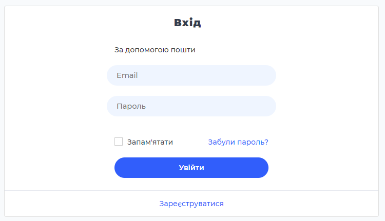

## About project 
This project was written as a forum for cooks, where they can leave their own recipes, share information about its preparation. Users also have the option to save recipes to their own record book and search for relevant recipes. 
There is also a section for admin, where he can view statistics on recipes for certain categories, perform CRUD operations with them, find out information about users and configure categories.
## Project use
- PHP on framework Laravel
- Vue.js
- SCSS
- Chart.js
- Vue-axios
- Vue-chartjs
- Vue-owl-carousel
- Vue-router
- Vuejs-paginate
- Jquery
- UIkit
- Materialize.js

## Installation
Start with cloning:

     git clone https://github.com/tymosh4uk/coursework.git

     cd coursework

     cp .env.example .env

then install composer and front-end modules:

     composer install

     npm install

     npm run dev

and last:

      php artisan migrate

      php artisan key:generate

## Screenshots
### Admin Dashboard Statistics

### Admin Receipts CRUD

### Admin Updating Receipts

### Admin Creating New Categories

### Admin Search

### User Login

### User Main Page

### User Creating New Receipt

### User Showing All Receipts

### User Search

### User Showing Certain Receipt

### User Comments Section

